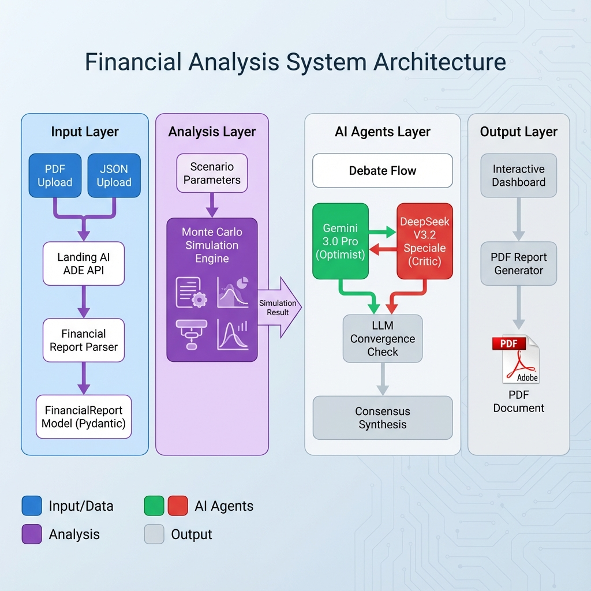

# Counterfactual Financial Oracle

> An intelligent multi-agent AI system for counterfactual financial analysis and scenario modeling

[](https://www.python.org/downloads/)
[](LICENSE)

## Overview

The **Counterfactual Financial Oracle** is a sophisticated financial analysis platform that combines advanced AI agents, Monte Carlo simulation, and automated document extraction to analyze "what-if" scenarios in corporate finance. This system enables financial analysts to explore counterfactual scenarios by adjusting key parameters and observing their impact through AI-powered multi-agent debate and validation.

### Key Features

✨ **Multi-Agent AI Debate System**
- **OpenAI Agent** (Optimist): Identifies growth opportunities and upside potential
- **DeepSeek Agent** (Critic): Challenges assumptions and identifies risks
- **Automated Report Generator**: Compiles findings into comprehensive PDF reports

📊 **Advanced Financial Modeling**
- Monte Carlo simulation with 10,000 scenarios
- DCF valuation with Gordon Growth model
- Real-time counterfactual scenario analysis
- Mathematical grounding to prevent AI hallucinations

📄 **Intelligent Document Processing**
- PDF extraction via Landing AI ADE (Automatic Document Extraction)
- Direct JSON upload for pre-extracted data
- Support for 10-K, 10-Q, and annual reports
- Tier 1-3 financial data extraction (income statement, balance sheet, cash flow, segments, geographic data, non-GAAP metrics)

🎯 **Interactive Analysis Dashboard**
- Real-time scenario adjustment (OpEx, Revenue Growth, Discount Rate)
- Live AI agent debate visualization
- Convergence detection and consensus building
- Professional PDF report generation

## Architecture



### Component Flow

1. **Input Layer**: Upload financial documents (PDF or JSON)
2. **Data Processing**: Landing AI ADE extracts and parses financial statements
3. **Analysis Engine**: Monte Carlo simulation generates scenario outcomes
4. **AI Agents Layer**: Multi-agent debate validates and challenges assumptions
5. **Output Layer**: Interactive dashboard and PDF reports

## Installation

### Prerequisites

- Python 3.8 or higher
- pip package manager
- API keys for:
  - Landing AI (for PDF extraction)
  - Google Gemini API
  - DeepSeek API

### Setup

1. **Clone the repository**
   ```bash
   git clone https://github.com/KhoaLaptop/Counterfactual-Financial-Oracle-67.git
   cd Counterfactual-Financial-Oracle-67
   ```

2. **Install dependencies**
   ```bash
   pip install -r counterfactual_oracle/requirements.txt
   ```

3. **Configure API keys**
   
   Create a `.env` file in the `counterfactual_oracle` directory:
   ```env
   LANDINGAI_API_KEY=your_landing_ai_key
   OPENAI_API_KEY=your_openai_key
   DEEPSEEK_API_KEY=your_deepseek_key
   ```

4. **Run the application**
   ```bash
   streamlit run counterfactual_oracle/app.py
   ```

5. **Access the dashboard**
   
   Open your browser and navigate to:
   ```
   http://localhost:8501
   ```

## Usage

### Quick Start

1. **Upload Financial Data**
   - Choose between PDF upload (auto-extraction) or JSON upload (pre-formatted)
   - Sample data file available: `counterfactual_oracle/data/apple_fy24_q1.json`

2. **Configure Scenario Parameters**
   - Adjust OpEx Delta (-500 to +500 basis points)
   - Modify Revenue Growth Delta
   - Set Discount Rate Delta

3. **Run Analysis**
   - Click "▶️ Run Analysis" to execute Monte Carlo simulation
   - View simulation results (NPV, Revenue, EBITDA)

4. **Start AI Debate**
   - Click "🎙️ Start AI Debate" to launch multi-agent analysis
   - Watch real-time debate between Gemini (optimist) and DeepSeek (critic)
   - Review consensus summary and final verdict

5. **Generate Report**
   - Click "📥 Generate PDF Report" to create comprehensive analysis
   - Download PDF with all findings, debate summary, and recommendations

### JSON File Format

For direct JSON upload, use the following structure:

```json
{
  "income_statement": {
    "Revenue": 119575,
    "CostOfGoodsSold": 64720,
    "GrossProfit": 54855,
    "OpEx": 14482,
    "EBITDA": 40373,
    ...
  },
  "balance_sheet": { ... },
  "cash_flow": { ... },
  "segment_data": [ ... ],
  "kpis": { ... }
}
```

See `counterfactual_oracle/data/apple_fy24_q1.json` for a complete example.

## Project Structure

```
counterfactual_oracle/
├── app.py                      # Main Streamlit application
├── styles.css                  # Custom UI styling
├── requirements.txt            # Python dependencies
├── src/
│   ├── models.py              # Pydantic data models
│   ├── logic.py               # Financial calculation engine
│   ├── debate_prompts.py      # AI agent prompt templates
│   └── agents/
│       ├── landing_ai.py      # PDF extraction client
│       ├── simulator.py       # Monte Carlo simulation agent
│       ├── critic.py          # DeepSeek critic agent
│       ├── evaluator.py       # Report generation agent
│       └── debate_agent.py    # Multi-agent debate orchestrator
├── data/
│   ├── sample_report.json     # Demo financial data
│   └── apple_fy24_q1.json     # Apple FY24 Q1 example
└── tests/
    └── test_ade_parsing.py    # Unit tests
```

## Technology Stack

- **Frontend**: Streamlit (Interactive dashboard)
- **Backend**: Python 3.8+
- **AI Models**:
  - OpenAI GPT-4 (Optimistic analysis)
  - DeepSeek (Critical analysis)
- **Data Processing**: Landing AI ADE API
- **Financial Modeling**: NumPy, Pandas
- **Data Validation**: Pydantic
- **Report Generation**: ReportLab (PDF)

## Features in Detail

### Monte Carlo Simulation

The simulation engine runs 10,000 scenarios to model financial outcomes under varying conditions:
- Revenue volatility modeling
- Operating expense variance
- Tax rate fluctuations
- Discount rate sensitivity
- NPV distribution analysis

### AI Agent Debate

The multi-agent system provides balanced analysis through:
- **Structured Prompts**: Mathematical grounding rules prevent hallucinations
- **Solvency Logic Gate**: Prevents false liquidity alarms by checking cash reserves against FCF burn
- **Convergence Detection**: Uses LLM analysis to detect true consensus (not just keyword matching)
- **Consensus Phase**: Agents actively seek common ground in later rounds
- **Evidence-Based Arguments**: All claims must be backed by data from financial reports

### Document Extraction

Landing AI ADE intelligently extracts:
- **Tier 1**: Core financial statements (Income, Balance Sheet, Cash Flow)
- **Tier 2**: Segment data, geographic breakdown, debt schedules
- **Tier 3**: Non-GAAP metrics, MD&A commentary, risk factors
- **Performance Metrics**: Tracks extraction time, page count, and credit usage

### Simulation Engine

- **Dynamic Base Rates**: Simulation binds to actual historical revenue growth (not generic baselines)
- **Monte Carlo**: 10,000 scenarios modeling volatility and structural shifts
- **Traceability**: Full audit log of assumptions and driver logic

## Contributing

Contributions are welcome! Please follow these guidelines:

1. Fork the repository
2. Create a feature branch (`git checkout -b feature/AmazingFeature`)
3. Commit your changes (`git commit -m 'Add some AmazingFeature'`)
4. Push to the branch (`git push origin feature/AmazingFeature`)
5. Open a Pull Request

## License

This project is licensed under the MIT License - see the [LICENSE](LICENSE) file for details.

## Acknowledgments

- **Landing AI** for document extraction capabilities
- **Gemini** for optimistic financial analysis
- **DeepSeek** for critical validation

## Contact

**Khoa Dang**
- LinkedIn: [Anh Khoa Đặng](https://www.linkedin.com/in/anh-khoa-%C4%91%E1%BA%B7ng-ba6992316/)

**Quan Pham**
- LinkedIn: [Lê Minh Quân Phạm](https://www.linkedin.com/in/plminq/)

- Project Link: [https://github.com/KhoaLaptop/Counterfactual-Financial-Oracle-67](https://github.com/KhoaLaptop/Counterfactual-Financial-Oracle-67)
---

